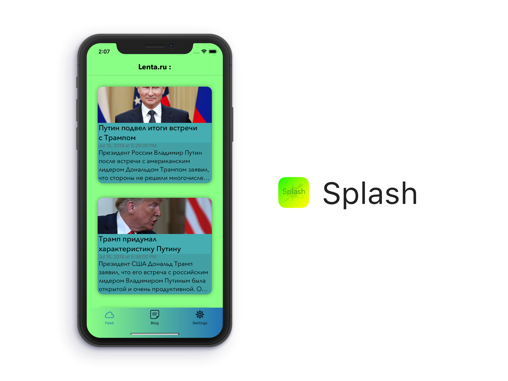
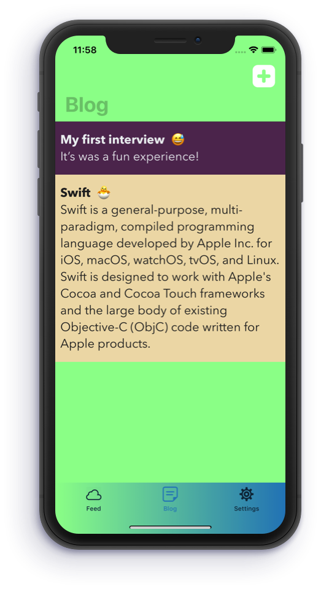

# Splash 🍋

  <a href="https://developer.apple.com/swift/">
    

It's an *RSS* app. Read news. Take notes.
Written in **Swift** with use of **MVP** architecture.

## Usage
For link use for example `https://lenta.ru/rss`

  

### Take notes 📝

	  

